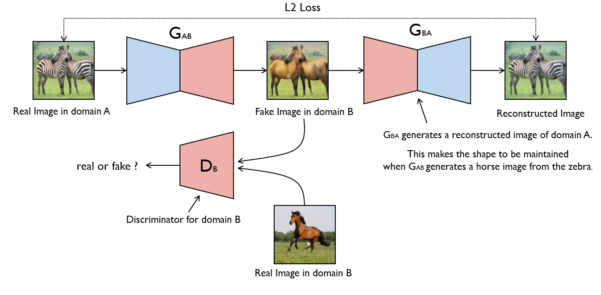

# CycleGAN Implementation

This repository contains an implementation of the CycleGAN model proposed in the paper "Unpaired Image-to-Image Translation using Cycle-Consistent Adversarial Networks". The CycleGAN model enables unpaired image-to-image translation, allowing us to learn mappings between different domains without requiring paired training data.




## Overview

CycleGAN is a generative adversarial network (GAN) architecture that can learn to translate images from one domain to another without the need for paired examples. It consists of two generators and two discriminators. The generators learn to translate images from one domain to another and vice versa, while the discriminators aim to distinguish between the generated and real images.

## Prerequisites

- Python 3.6+
- PyTorch
- NumPy
- matplotlib

## Getting Started

To get started with this project, follow these steps:

1. Clone this repository:

   ```
   git clone https://github.com/TRINETRA-DEVKATTE/cyclegan-implementation.git
   ```

2. Open the `CycleGan.ipynb` file in Jupyter Notebook or any other compatible environment.

3. Install the required dependencies by running the following command in a code cell:

   ```python
   !pip install -r requirements.txt
   ```

4. Download the dataset or prepare your own dataset.

5. Follow the instructions provided in the notebook to train and test the CycleGAN model.

For more detailed instructions and customizable options, please refer to the notebook.


## Contributing

Contributions are welcome! If you find any issues or have suggestions for improvements, please open an issue or submit a pull request.

## Acknowledgements

- The code structure and some utilities are based on the official CycleGAN implementation by Jun-Yan Zhu et al.
- We would like to thank the authors of the CycleGAN paper for their valuable contributions.

## References

- [CycleGAN: Unpaired Image-to-Image Translation using Cycle-Consistent Adversarial Networks](https://arxiv.org/abs/1703.10593)
